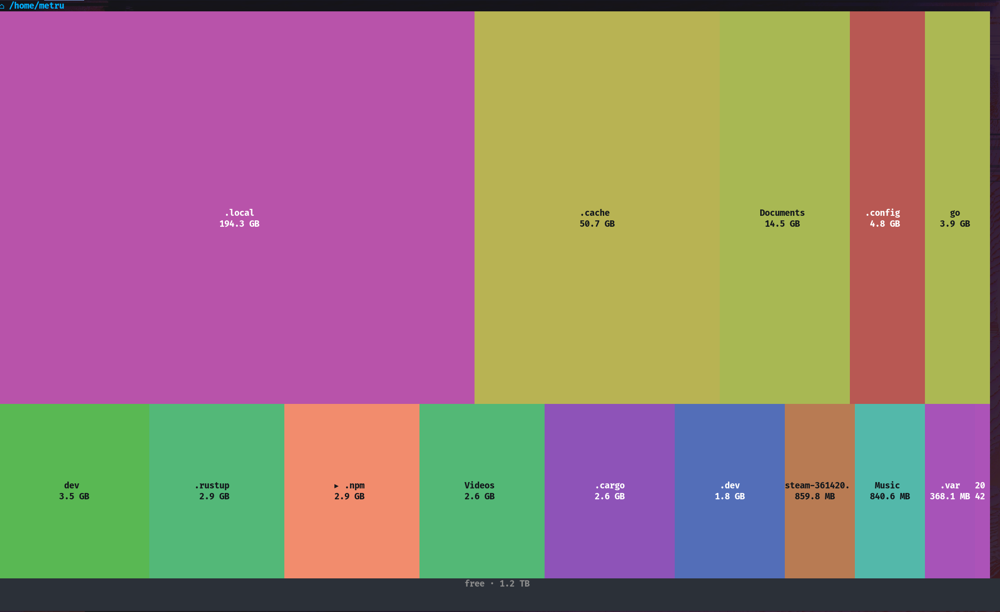

# spacefinder



Visualize disk usage as an interactive **treemap** in your terminal — a
text-mode take on [spacesniffer][1]
and [filelight](https://apps.kde.org/filelight/).

The full home dir scan runs like `du`: one fast pass up front (the splash
shows a spinner, the current path, and entry counts), then drilling is
effectively instant.

Deleting always asks you to **type the exact name** of the entry inside a modal
dialog — accidental deletions require real intent. The scan root itself can
never be deleted through the UI.

## Install

```bash
curl -fsSL https://raw.githubusercontent.com/metruzanca/spacefinder/main/install.sh | sh
```

Downloads the latest release binary for your OS/arch, verifies its checksum, and
installs it to `~/.local/bin` (override with `PREFIX` or `BINDIR`). Or build from
source:

```bash
go install github.com/metruzanca/spacefinder@latest
```

## Usage

```
spacefinder [path]
```

`path` defaults to user's home directory or root if root.

Spacefinder supports both keyboard inputs via arrow/vim keys, `enter` & `esc` for zoom in/out and mouse input with double clicking to zoom in. `del` to delete(with confirmation) and `q` to quit.

## TODO

For v0.1.0 I choose to not render small folders/files. I'm considering adding a vertical scroll to the pages to show every folder/file no matter how small.

Filters are another idea from [Spacesniffer][1] which would be useful: filter by file type, age, file size. Spacesniffer also net you tag files, which could be useful for filtering. And exporting a report could also be useful, though I've never used that feature from spacesniffer.


<!-- References -->

[1]: https://uderzo.it/main_products/space_sniffer/
